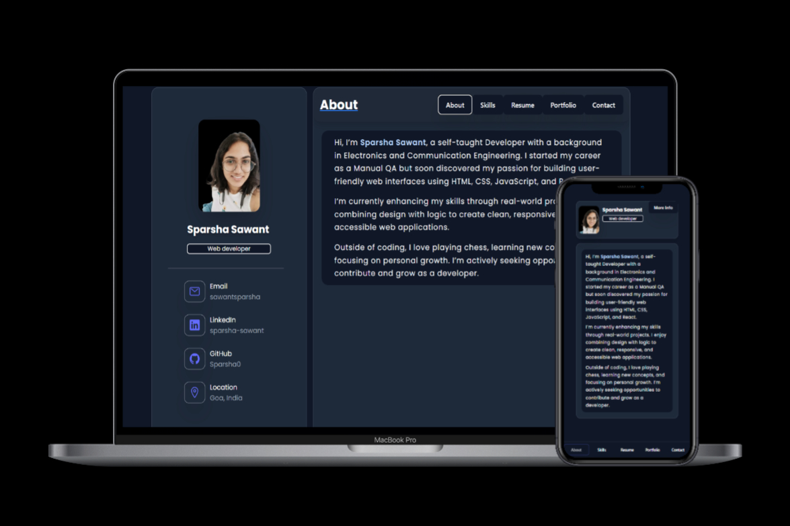

<h2 align="center">
  Portfolio Website  
</h2>

  

 

 &nbsp;
 &nbsp;

<h3 align="center">
    🔹
    <a href="https://github.com/Sparsha0/Portfolio/issues">Report Bug</a> &nbsp; &nbsp;
    🔹
    <a href="https://github.com/Sparsha0/Portfolio/issues">Request Feature</a>
</h3>

## TL;DR

This is a **static portfolio website** built with **React and Tailwind CSS**. It showcases my projects, skills, and resume. It's fully responsive and easy to customize.

> Fork it, customize it, and make it your own. If you use my design, consider giving credit by linking back to [Sparsha0](https://sparsha0.github.io/Portfolio/). Thanks!

## Built With

My personal portfolio <a href="https://sparsha0.github.io/Portfolio/" target="_blank">sparshaPortfolioWeb</a> which features some of my github projects as well as my resume and technical skills. 

This project was built using these technologies.

- ⚛️ React.js
- 💨 Tailwind CSS
- 🔧 Vite 
- 💻 VSCode

## Features

**📖 Multi-Page Layout**

**🎨 Styled with Modern UI with Tailwind CSS**

**📱 Fully Responsive**

## Getting Started

Make sure you have **Node.js** and **Git** installed.

1. Clone the repository  
   `git clone https://github.com/yourusername/your-portfolio.git`

2. Navigate into the project directory  
   `cd your-portfolio`

3. Install dependencies  
   `npm install`

4. Run the development server  
   `npm run dev`.

## Usage Instructions

Open the project folder and Navigate to `/src`.  
You will find all the components used and you can edit your information accordingly.

### Show your support

Give a ⭐ if you like this website!

